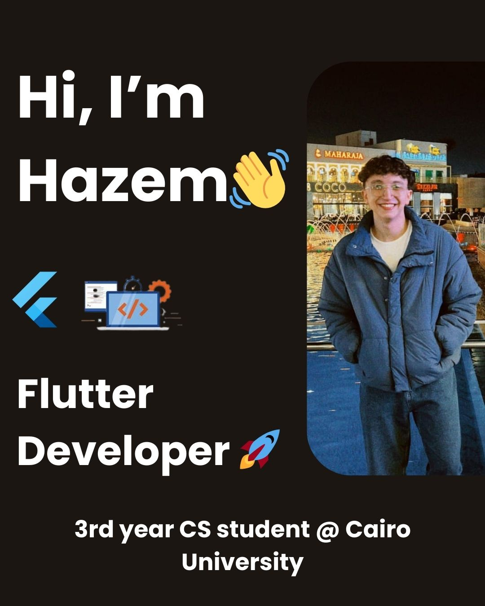

<!-- Typing Intro -->
<h1 align="center">Hi 👋, I'm Hazem Ahmed</h1>

  

Software Engineer & Computer Science student passionate about building scalable software, solving complex problems, and designing clean architectures.

---

---

# 👨‍💻 About Me

- 🎓 Computer Science Student – Cairo University  
- 💻 Passionate about **Software Engineering & System Design**
- 🧠 Strong background in **OOP, Data Structures & Algorithms**
- ⚙️ Interested in **Backend Systems, Full Stack Development, and Scalable Software**
- 🚀 Always learning and building real-world projects

---

# 🚀 Featured Projects

## ✈️ Airline Reservation & Management System

A **C++ airline management system** built using Object-Oriented Programming and layered architecture.

### Tech Stack
- C++
- OOP
- JSON Persistence
- Layered Architecture

### Features
- Flight scheduling and management
- Ticket booking system
- Payment management
- Aircraft maintenance tracking
- JSON-based data persistence

🔗 **GitHub Repo:** ([Add Link Here](https://github.com/Hazem2911/Airline-System))

---

## 🎮 Board Games Application with AI

A **C++ board games platform** with intelligent AI opponents.

### Tech Stack
- C++
- Object-Oriented Programming
- AI Algorithms (Minimax, Backtracking)

### Features
- Interactive game menu
- Multiple playable games
- AI-powered opponents
- Complete gameplay system

🔗 **GitHub Repo:** (Add Link Here)

---

## 📚 BiblioGate – Full Stack Online Library

A **full-stack web platform** for managing and browsing books online.

### Tech Stack
- Django
- JavaScript
- HTML
- CSS

### Features
- Secure authentication
- Book browsing and search
- Real-time availability
- User-friendly interface

🔗 **GitHub Repo:** (Add Link Here)

---

## 👓 OptiStyle – Mobile Shopping App

A **Flutter mobile application** for browsing and purchasing eyewear products.

### Tech Stack
- Flutter
- Dart
- Firebase Authentication
- Firebase Database

### Features
- User authentication
- Product browsing
- Order management
- Responsive mobile UI

🔗 **GitHub Repo:** (Add Link Here)

---

# 🛠 Tech Stack

### Programming Languages

### Frameworks & Technologies

### Tools

---

# 🧠 Computer Science Concepts

- Object-Oriented Programming (OOP)
- Data Structures & Algorithms
- Design Patterns
- SOLID Principles
- APIs
- Databases
- Software Engineering Principles
- Web Development

---

# 📊 GitHub Stats

---

# 🔥 GitHub Streak

---

# 📈 Contribution Graph

---

# 📬 Connect With Me

💼 **LinkedIn**  
https://www.linkedin.com/in/hazem-ahmed-39273b309/

📧 **Email**  
hazemahmedd56@gmail.com

---

⭐ *Always learning. Always building.*

  

